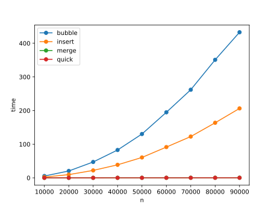

# Testing the time efficiency of different Sorting Algorithms

This repo deals with the sorting algorithms **Bubble** Sort, **Insertion** Sort, **Merge** Sort and **Quick** Sort and compares them according to their **execution time** for different sizes of input arrays.

## Bubble Sort

The Bubble Sort algorithm sorts by iteratively swapping consecutive elements if they are not in correct order.

The used implementation stops when the previous iteration over the array did not swap any elements (which is tracked by the "swapped" variable). 
This avoids useless iterating over already sorted arrays.

## Insertion Sort

Insertion Sort works similar to how you would sort playing cards.
Every element of the array gets pushed so far to the left until it is in the correct place in the sorted part of the array which accumulates at the left.

Just like the Bubble Sort Insertion Sort sorts the array in place, which reduces the algorithms memory consumption.

## Merge Sort

Merge sort is based on recursively splitting up the input array into its elements which then can be gradually merged back together into bigger and bigger chunks until the last two chunks get merged into the sorted array.

For this algorithm a recursive implementation is useful, because it allows to build a tree that successively splits the array down to its elements. The recursion is interrupted, when the input to the next call of the recursive function is a single element. From there on the tree is traversed in the opposite direction while merging the tips of the branches back together in correct order.
This implementation too is only modifying the array in place. The correct accessing of different parts of the array is controlled by an l(eft) and r(ight) index to restrict each recursion.

## Quick Sort

Quick Sort too is an algorithm that suggests a recursive implementation as in every step the elements of the array are sorted to the left or to the right of a (in this implementation arbitrarily) chosen pivot element based on if they are less or greater than it. Each newly created half now is sorted the same way, and so on.

A weakness of this implementation is the random choice of the pivot element instead of choosing the median value of the array, because this causes, that deeper recursions have to be executed.
## Comparison

You can clearly see, that Merge and Quick outperform the other two with Quick Sort being even slightly faster than Merge. Also their execution time seems to be linearly dependent on the array size as opposed to Bubble and Insert with quadratic looking curves. This ensures that even huge arrays will be sorted in relatively litte time.

## Good to know

Python version: 3.8

Machine: Windows, AMD Ryzen 5 4000 Series, 8 GB RAM

All used implementations originate from https://www.geeksforgeeks.org/ (some adjustments were made). You can find a direct link to each implementation in the corresponding file.
